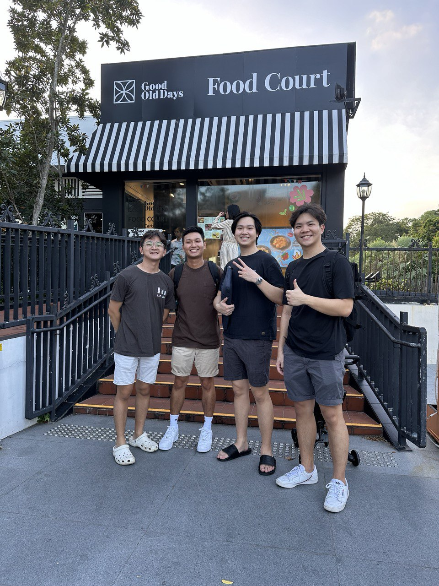

## DSA3101 BACKEND
This is the backend for the DSA3101 project. It is a RESTful API that provides endpoints for the frontend to interact with the database. The backend is built using Flask, a Python web framework. The database used is mySQL.

### How to run the backend
1. git clone the repository
2. `docker-compose build --no-cache`
3. `docker-compose up`
4. Try the endpoints using Postman or any other API testing tool

### Project Folder Structure
.
├── README.md
├── data
│   ├── csv
│   │   ├── 00-mock_emp_details.csv
│   │   ├── 01-mock_availability.csv
│   │   ├── 02-mock_events.csv
│   │   ├── 03-mock_wage.csv
│   │   └── 04-mock_customer_demand_past.csv
│   └── json
│       ├── expected_customers.json
│       └── public_holidays.json
├── docker-compose.yml
├── images
│   └── good_old_days.jpg
├── mysql_db
│   ├── 00-create-db.sql
│   ├── 01-schema.sql
│   ├── 02-load-data.sql
│   └── custom.cnf
└── src
    ├── Dockerfile
    ├── algo.py
    ├── app.py
    ├── db_utils.py
    ├── demand_forecast.py
    ├── generate_data.py
    ├── model
    │   ├── __init__.py
    │   ├── employee.py
    │   ├── event.py
    │   └── schedule.py
    ├── requirements.txt
    ├── test_app.py
    ├── tests
    │   ├── __init__.py
    │   ├── test_app.py
    │   └── test_utils.py
    └── utils.py

### Endpoints
1. Create Employee: POST /employee
2. Get Employees: GET /employee
3. Update Employee: PUT /employee/<emp_id>
4. Delete Employee: DELETE /employee/<emp_id>
5. Get Wage: GET /wage
6. Create Event: POST /event
7. Get Events: GET /event
8. Update Event: PUT /event/<event_id>
9. Delete Event: DELETE /event/<event_id>
10. Create Schedule: POST /schedule
11. Get Schedules: GET /schedule
12. Store Optimal Schedule: POST /post_schedule
13. Update Schedule: PUT /schedule/<schedule_id>
14. Delete Schedule: DELETE /schedule/<schedule_id>
15. Post Past Demand: POST /post_past_demand
16. Get Past Demand: GET /get_past_demand
17. Post Demand Forecast: POST /post_demand_forecast
18. Get Demand Forecast: GET /get_demand_forecast

## Contributors
